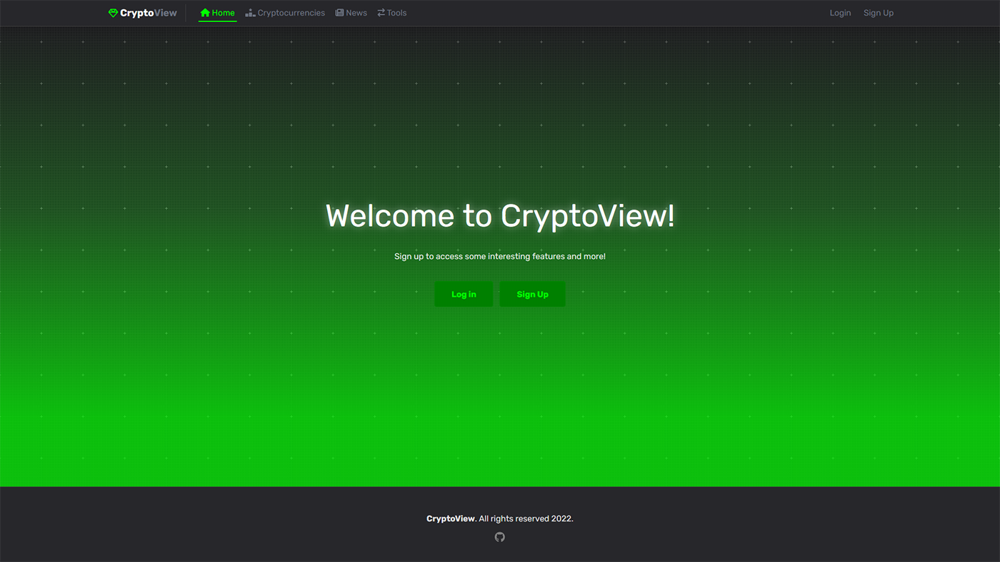

# CryptoView
💫 Manage your favorite crypto assets, read news and more. 

<center>


</center>




## 📋 Description 

CryptoView is a project that uses [CoinCap](https://docs.coincap.io/) and [CryptoPanic](https://cryptopanic.com/developers/api/) APIs. It provides some tools that everyone can use.

* News feed from CryptoPanic
* Cryptocurrency Converter Calculator
* List of top cryptocurrencies

## 🔩 Tools
* React.js library for interfaces
* Express.js with Netlify (Serverless) Functions
* TailwindCSS framework
* Plotly.js for price charts
* Turnstone for advanced search features
* React Router DOM
* ESLint + Prettier

## ✨ Test

### Live demo
* https://cryptoview-plus.netlify.app

### Run app locally
```
git clone https://github.com/kypexfly/cryptoview.git
cd cryptoview
npm install
```
Add `.env` file to the root directory, following the `.env.example` file.
```
MONG_URI="your mongodb uri"
JWTSECRET="your jwt secret key"
```
Start the app
```
npm netlify dev
```

## 💻 Analyze bundle size

* Run `npx vite-bundle-visualizer`, then open `stats.html` in browser.


## 🧪 Possible improvements / To Do

* Add Typescript types (strictly)
* Add features for signed in users
* Improve UX, fetching, loading states
    * News pagination
    * Mobile friendly table 
* Reduce more bundle size, manual chunks split.

##  🪄 Completed To Do
* ~~Migrate from Webpack to Vite~~
* ~~Migrate to react/tanstack query~~
* ~~Migrate to TailwindCSS~~
* ~~Reduce bundle size (plotly)~~
* ~~Migrate to serverless backend (Netlify/Vercel functions)~~