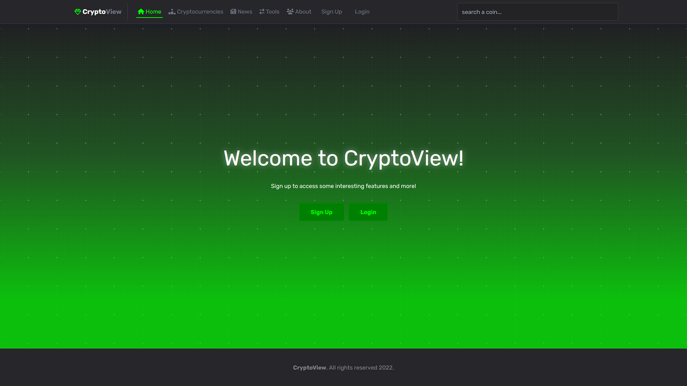

# CryptoView
<<<<<<< HEAD

=======
<<<<<<< HEAD
>>>>>>> 3e52dc2ace529b5692a9f818f4c853788894cef9
💫 Manage your favorite crypto assets, read news and more. 




## 📋 Description 

CryptoView is a project that uses [CoinCap](https://docs.coincap.io/) and [CryptoPanic](https://cryptopanic.com/developers/api/) APIs. It provides some tools that everyone can use.
<<<<<<< HEAD
=======
=======
CryptoView is a project that uses [CoinCap](https://docs.coincap.io/) and [CryptoPanic](https://cryptopanic.com/developers/api/) APIs. It provides some tools that everyone can use:
>>>>>>> 31a2fe8ba16c678ebd72fc014605f24b8bc255f5
>>>>>>> 3e52dc2ace529b5692a9f818f4c853788894cef9

* News feed from CryptoPanic
* Cryptocurrency Converter Calculator
* List of top cryptocurrencies

<<<<<<< HEAD
=======
<<<<<<< HEAD
>>>>>>> 3e52dc2ace529b5692a9f818f4c853788894cef9
## 🔩 Tools
* React.js
* Express.js
* Plotly.js
* Turnstone
* React Router DOM
* ESLint + Prettier

## 🪄 Test
* Run app locally
```
git clone https://github.com/kypexfly/cryptoviewapp.git
cd cryptoviewapp
npm install
npm run app
```
* Previously, add `.env` file to `./server` following the `.env.example` file.
```
PORT=4000
MONG_URI=""
JWTSECRET=""
```

Live demo: Not available until migration to serverless.


## 🧪 Possible improvements / To Do
<<<<<<< HEAD
=======
=======
## Analyze bundle size

* Run `npx webpack-bundle-analyzer ./build/bundle-stats.json`
OR
* Run `npm run analyze`

## To do
>>>>>>> 31a2fe8ba16c678ebd72fc014605f24b8bc255f5
>>>>>>> 3e52dc2ace529b5692a9f818f4c853788894cef9

* Migrate to serverless backend
* Migrate to react/tanstack query
* Reduce bundle size (plotly)
* Add features for signed in users
    * Favorite cryptocurrencies (?)
    * ...

<<<<<<< HEAD
=======
<<<<<<< HEAD
>>>>>>> 3e52dc2ace529b5692a9f818f4c853788894cef9
## 💻 Analyze bundle size

* Run `npm build` & `npx webpack-bundle-analyzer ./build/bundle-stats.json`
OR
* Run `npm run analyze`
<<<<<<< HEAD
=======
=======

## Ideas to improve this project
* ~~https://stackoverflow.com/questions/36504768/deploy-the-backend-and-frontend-on-the-same-heroku-app-dyno~~ Heroku is not free anymore
* https://stackoverflow.com/questions/42761068/paginate-javascript-array (should be done in backend)
>>>>>>> 31a2fe8ba16c678ebd72fc014605f24b8bc255f5
>>>>>>> 3e52dc2ace529b5692a9f818f4c853788894cef9
